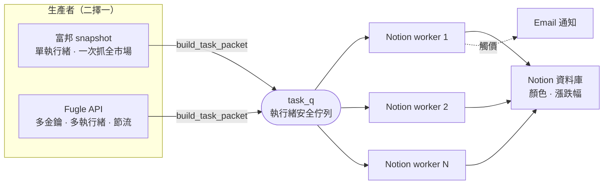

# Notion StockSync — 台股即時監控服務

在台股交易時段每分鐘抓取全市場即時股價，將漲跌以紅／綠色與漲跌幅同步到 **Notion 儀表板**，並對訂閱者在股價觸及目標價時發送 email 通知。

> 以 Python 多執行緒實作的「生產者／消費者」管線，抓價來源可在**富邦證券 snapshot** 與 **Fugle API** 之間熱切換，下游更新邏輯零改動。

---

## 架構概觀

系統以 `main.py` 的**市場狀態機**（盤前 → 盤中 → 盤後）驅動，盤中每分鐘跑一輪核心迴圈。每一輪都是一條**生產者／消費者**管線，透過一個共用的執行緒安全佇列（`queue.Queue`）解耦：

- **生產者**：負責抓價，依環境變數 `PRICE_SOURCE` 二擇一。
  - `fubon`（主）：一次 `snapshot.quotes()` 抓回整個市場（~1500+ 檔），**單執行緒**即可，SDK 登入後連線重用。
  - `fugle`（退路）：逐支輪詢，用**多把金鑰、多執行緒**並行並節流，突破單帳號限流。
  - 兩條路透過共用的 `build_task_packet()` 產出**格式一致**的任務封包，所以切換來源時消費者完全不需改動。
- **消費者**：`N` 個 `Notion_update_worker` 執行緒（`N` = Notion 金鑰數），從佇列取封包並行寫入 Notion，觸價時觸發 email 通知。生產結束後對佇列送出 `None`「毒丸」信號讓消費者優雅收工。



---

## 技術挑戰與解法

**1. 免費行情 API 的限流吃不下整個市場**
- **問題**：Fugle 免費版限流是「**每帳號** 60 次／分鐘」，且不支援一次抓全市場，只能逐支查詢；近 1300 檔股票逐支抓，一分鐘根本抓不完。
- **判斷**：瓶頸在 API 端而非本地運算，加執行緒沒用——真正的解是換一個「一次能抓整個市場」的資料來源。
- **解法**：改接**富邦證券 snapshot**，一次呼叫抓回全市場、限流 300／分鐘綽綽有餘。同時把 Fugle 逐支路保留為退路，用「多把金鑰各配一個執行緒 + 節流 + 三層金鑰備援重試」把負載分散到多個帳號，避免單一來源故障時完全停擺。

**2. 每分鐘全量寫 Notion 太重，且多數是重複價**
- **問題**：整個市場每分鐘全量寫回 Notion，寫入量大又慢，而多數股票在相鄰兩輪其實沒有變動。
- **判斷**：真正需要寫的只有「價格有變」的股票。
- **解法**：在生產端做**分鐘級去重**——用 module 層級狀態記住每檔上一輪的價格，與本輪相同就直接跳過，大幅削減對 Notion 的寫入次數。

**3. 兩套抓價 API 的資料格式不同，怕污染下游**
- **問題**：富邦與 Fugle 回傳的欄位結構不一樣，若讓消費者去分辨來源，程式會變得脆弱且難維護。
- **判斷**：來源差異應該收斂在生產端，消費端只該看到一種格式。
- **解法**：抽出共用的 `build_task_packet()`，兩條抓價路都輸出**同一種任務封包**。切換 `PRICE_SOURCE` 時，消費者一行都不用改——這也讓「主來源／退路」的設計成立。

---

## 技術棧

`Python` · `threading` / `queue`（生產者／消費者並行）· **富邦 Neo SDK** · **Fugle Market Data API** · **Notion API**（data sources）· `Selenium`（財經新聞爬取）· SMTP（email 通知）· `python-dotenv`

---

## 快速開始

```bash
python -m venv .venv && source .venv/bin/activate   # Windows: .venv\Scripts\activate
pip install -r requirements.txt

# 設定 .env（抓價來源、Notion / 行情金鑰、憑證路徑等）
#   PRICE_SOURCE=fubon
#   FUBON_ACCOUNT / FUBON_PASSWORD / FUBON_CERT_PATH=path/to/cert.pfx
#   NOTION_API_KEY_LIST=...

python seed_main_db.py    # 首次：把股票種進空的 Notion 主資料庫
python main.py            # 啟動監控服務
```

---

## 專案文件

- **[RUNBOOK.md](RUNBOOK.md)** — 完整維運手冊：環境變數細節、Notion 資料庫結構、重啟流程、常見問題排查。
- **[docs/](docs/)** — 技術策略、Windows 部署、抓價來源遷移紀錄等設計文件。
